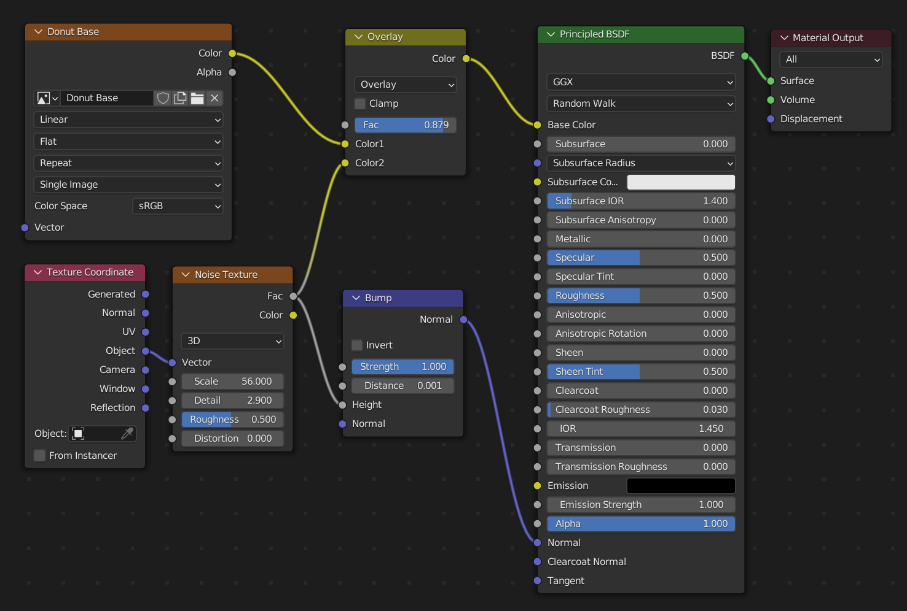
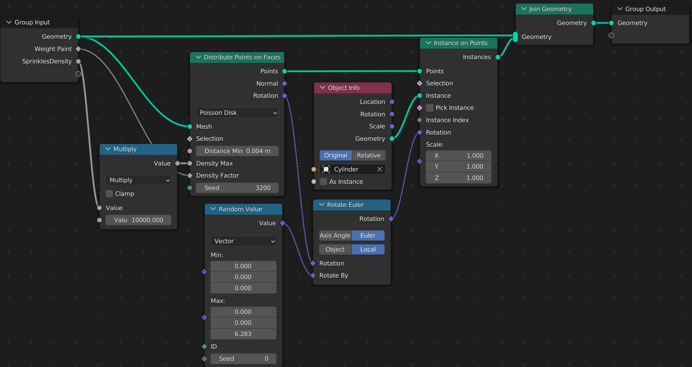

# Blender_
Learn about Blender and make it.

### [ArtStation - Explore](https://www.artstation.com/?sort_by=community) and [ArtStation - Explore](https://www.artstation.com/?sort_by=trending)

Blender UI Resolution: [Blender调整UI显示大小 - 简书 (jianshu.com)](https://www.jianshu.com/p/4af6e98cad13)

With https://www.youtube.com/watch?v=nIoXOplUvAw  
## Notes: (Donut Making)

### Layout

  - 
    1. F12 to Render the Image
    2. G to grab the object to move, R to rotate it, S to scale it
    3. G and [X,Y,Z] to move along the axes
    4. After G (and so on), Middle Mouse Button to Find the closest axis to reach
    4. Right click to cancel the action.

  - 1. Only Middle Mouse Button, orbit the angle to see (Rotate view)
    2. Middle mouse button and Shift, Pan View
    3. Alt + Miiddle Mouse Button click => view changed, attach it to any one axis
    4. Zoom => (Rough, Scroll) and (Smooth, click the zoom button and move the mouse)
    5. [X] to delete
    6. [~] (next to 1) to get more view choices.

  - 1. *{Shift+D to duplicate objects.} **<=>** {Command C+V} ?*

Right click to change smooth

- 1. Shift A to add some new objects
  1. N to Edit Properties
  1. View > Local View > Toggle local view
  1. Tab to turn into edit mode
  1. Ctrl Tab to change other modes
  1. Proportional Editing can work, just scroll up and down to find the proper size!! G to grab
  1. Command+L / P to get the duplicated part 
  1. H to hide things and Alt+H to show them
  1. Alt+Left click to choose Edge Loop / Command+R Edge Loop
  
  Sometimes, Solidify should be at the priority of the Subdivision

### Sculpting 

  - 1. Ctrl Tab (change modes)

    2. G to grab, 

    3. Inflate > Stroke > Stroke Method > Airbrush

    4. Brush: F to change Radius, Shift+F to change Strength

       More Creative, but without Snap 

### Rendering and Shading (Video Part 5)

1. View > Align view > ...

   > [Is there a Way to Align Camera to View and Fit the View? - Blender Stack Exchange](https://blender.stackexchange.com/questions/8842/is-there-a-way-to-align-camera-to-view-and-fit-the-view)

2. Light > Object Properties > ...

3. Viewpoint Display to change the size of camera

4. Render Properties > Shadows > Cube Size (shadowing)
   Render Properties > Ambient Occlusion 

5. Material Properties > 
   Material can be used as [link Material]
   and can be edited in Shading with Node Editor

6. Shading > Node Editor

   - Command+Right Mouse to cut the link between the nodes or just drag
   - Common OP: Add [Noise Texture] and [Convert > ColorRamp]
   - Add Vector > Bumps (Normal and Height)

### Then, Texture Painting

Texture: [Poliigon - Textures, Models and HDRIs for 3D rendering](https://www.poliigon.com/)

1. Change original ColorRamp into Image Texture and give it the color
2. Text Draw 

Last, back to Shading :

### Geometry Nodes

Add a node > [Set Position] / [Distribute Points on the Faces] / [Join Geometry] / [Instances on Points]
Drag the object into Geometry nodes
Add [Rotate Euler] to control Rotate angle and [Random Value] to make it natural

However, next step is Weight Paint to fine-tune

Weight Paint > Object Data Properties > Vertex Group
                           Change it in the Modifier Properties.

Random with multiplies Weight Paint = Poisson Disk with just Weight Paint.

Now: 

DO NOT JUST DELETE the Object info! Cut the link first!

### Animation

Timeline: [I] to insert something. DO the action first and then Insert it to any frame.

TO see how the animation happens, see it in Animation > Dope Sheet. (and Graph Editor)
    In Graph Editor, Middle Mouse to move and Middle Mouse+Command to zoom
    Command+RightClick to add key frame.

### Lighting

Light and Fill Light and Dim Light

World Properties > Background light Strength

Render Properties > Color Management : Contrast and Exposure

#### Rendering Speedup : 

[Blender 3.0 Beginner Rendering Tutorial (Donut part 15) - YouTube](https://www.youtube.com/watch?v=JCLSJg9sdNI&list=PLjEaoINr3zgFX8ZsChQVQsuDSjEqdWMAD&index=17)

### Eventually 

Output Properties, output files as images and compile them into mp4 or so on.

